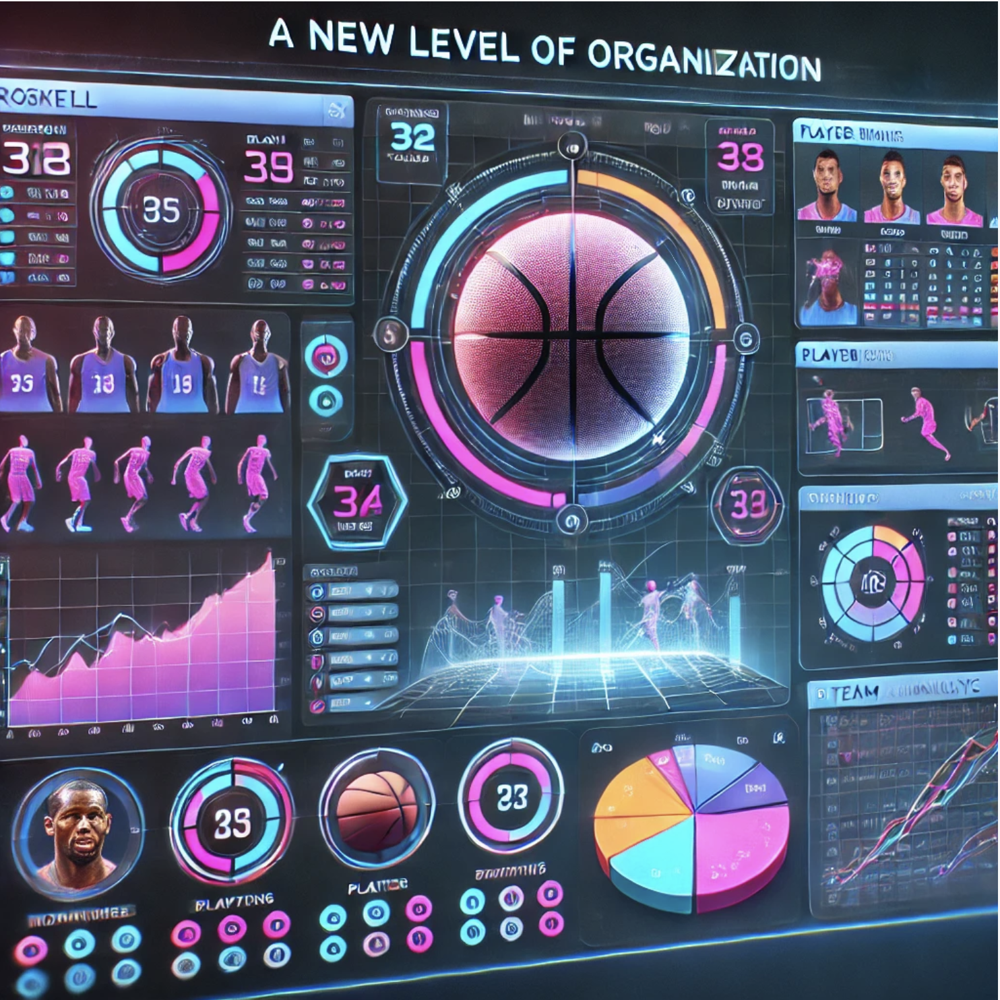

# interactive-basketball-roster

Front end React app. with a Python Flask backend.

## Overview

This is one of my first personal projects. The goal is to showcase the different languages I have learned over the years. The Interactive Basketball Roster is a program that allows you to keep up with your basketball team. All-in-one place to access player information, stats, and analysis. The program is built with a React front-end and a Python backend using Flask.

## Project Files

## How To Run Project

1. Clone Github Repository

- [Interactive Basketball Roster](https://github.com/ncmoliver/react-basketball-roster.git)

2. Start backend

- cd into 'backend' folder
- In the terminal:
  MAC OS:
- run `python3 main.py`
  Windows:
- run `python main.py`

3. Start frontend

- cd into 'interactiveRoster' folder
- **Split** into a new terminal:
  MAC OS run:
- `npm install`
- `npm run dev`

## Features

| Feature           | Description                                                                                                     |
| ----------------- | --------------------------------------------------------------------------------------------------------------- |
| CRUD              | Allows a fully functional API allowing users to create, read, update, and delete                                |
| Python Backend    | Allows for data consistancy, the app will store data across different sessions                                  |
| Custom Middleware | This app was create using custom API's created within the 'backend' folder to connect the backend and frontend. |
| REACT Frontend    | Creates an organized front-end, promoting organization, separated concerns, flexibility.                        |
